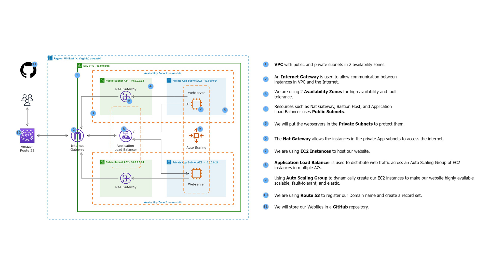

--
# Project Title

Hosting a Static HTML Web App on AWS

## Overview

This project involves deploying a static HTML web app on AWS using various services to achieve high availability, fault tolerance, and scalability. The resources and architecture are designed to provide a secure and reliable environment for hosting the web application.

## Deployment Steps

### Deployment Bash Script

```bash
#!/bin/bash
sudo su
yum update -y
yum install -y httpd
cd /var/www/html
wget https://github.com/azeezsalu/jupiter/archive/refs/heads/main.zip
unzip main.zip
cp -r jupiter-main/* /var/www/html/
rm -rf jupiter-main main.zip
systemctl enable httpd 
systemctl start httpd
```

1. **VPC Configuration:**
   - I Set up a VPC with public and private subnets across two availability zones for high availability and fault tolerance.
   - I Used an Internet Gateway to allow communication between instances in the VPC and the Internet.
   - I Placed resources such as Nat Gateway, and Application Load Balancer in public subnets directing traffic to    instance in the private subnets.

2. **Security and Connectivity:**
   - I Utilized the EC2 Instance Connect Endpoint for secure SSH access to resources in both public and private subnets.
   - I Implemented Nat Gateway to enable instances in private subnets to access the internet.

3. **Resource Placement:**
   - I Deployed web servers and database servers in private subnets to enhance security.

4. **EC2 Instances and Application Load Balancer:**
   - I Utilized EC2 instances to host the website and an Application Load Balancer to distribute web traffic across an Auto Scaling Group of EC2 instances in multiple availability zones.

5. **Auto Scaling Group:**
   - I Set up Auto Scaling Group to dynamically create EC2 instances for high availability, scalability, fault tolerance, and elasticity.

6. **Domain Registration:**
   - I Used Route 53 to register the domain name and create a record set for the web application.

7. **GitHub Repository:**
   - I Stored and managed web files using GitHub repository.

8. **AMI Creation:**
   - After the website is installed on the EC2 instance, I created an Amazon Machine Image (AMI) for backup and scalability purposes.

## Additional Notes

- I ensure proper security group configurations for each resource to enhance security, by configuring 3 different security groups to give access to the alb, the igw and ssh.
- I regularly updated and monitored the resources for security patches and performance optimization.
- I maintained backups and monitored logs for troubleshooting.

## Author

Jeffrey Egbagbe
